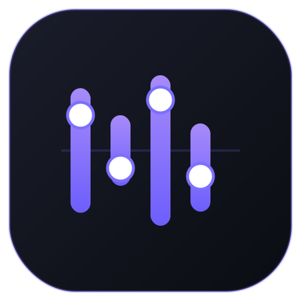

# EQ Pro

<p align="center">
  
</p>

A simple, lightweight sound booster + equalizer for Firefox — with a few presets.

**Why I made it:** most Firefox sound boosters aren't great. They break over
time, or don't even work properly. This one is simple, actually works, and is
open source and lightweight.

The other big reason: a lot of sound boosters interfere with **DRM content** on
streaming sites like Crunchyroll, Prime Video or Netflix and stop it from
playing at all. **This add-on doesn't have that problem.**


Repo: https://github.com/slopcodebutworking/eq-pro

## Features

- **10-Band Equalizer** (32 Hz – 16 kHz)
- **Volume Booster** bis 600 % (echte Prozente: 200 % = doppelte Lautstärke)
- **10 Presets** – Bass Boost, Voice Boost, Hiphop, EDM, LOUD AF, Smooth Loud,
  Classical, Pop, Metal, Podcast
- **Sofort wirksam** – Regler bewegen, Effekt ist direkt hörbar
- **Speichert Einstellungen** und wendet sie beim nächsten Öffnen automatisch an
- **Statusanzeige** – zeigt, wie viele Media-Elemente verbunden sind

## Installation

**➡️ Firefox Add-ons Store:** _coming soon_ — sobald die Prüfung durch ist, gibt
es hier den „Add to Firefox"-Button (ein Klick, dauerhaft installiert, mit
automatischen Updates).

<details>
<summary>Development build (temporär, nur zum Testen)</summary>

1. `about:debugging#/runtime/this-firefox` öffnen
2. **„Load Temporary Add-on"** klicken
3. Die `manifest.json` auswählen

Hinweis: temporär geladene Add-ons verschwinden beim nächsten Firefox-Neustart.
Der normale Weg für Nutzer ist der Store-Button oben.
</details>

## Nutzung

1. Ein Video/Audio abspielen (z. B. YouTube)
2. Auf das EQ-Icon in der Toolbar klicken
3. Regler bewegen – wirkt sofort

## Signal-Kette

```
MediaElement → Gain (Booster) → BiquadFilter ×10 (EQ) → Ausgang
```

Pro Media-Element wird ein eigener `AudioContext` erzeugt und direkt am Element
zwischengespeichert.

## Limitierungen

- **DRM-Seiten** (Crunchyroll, Prime Video, Netflix, Disney+): technisch nicht
  möglich – kein Browser-Add-on kann auf geschützte Streams zugreifen.
- Cross-Origin-Audio ohne CORS lässt sich nicht abgreifen (gleiche Grenze wie
  bei SoundFixer).

## Credits

Die Architektur (Code-Injektion aus dem Popup statt Content-Script, ein
`AudioContext` pro Element) ist inspiriert von
[SoundFixer](https://github.com/valpackett/soundfixer) von Val Packett
(Public Domain / Unlicense).

## Lizenz

MIT © 2026 [@slopcodebutworking](https://github.com/slopcodebutworking) — siehe [LICENSE](LICENSE).
